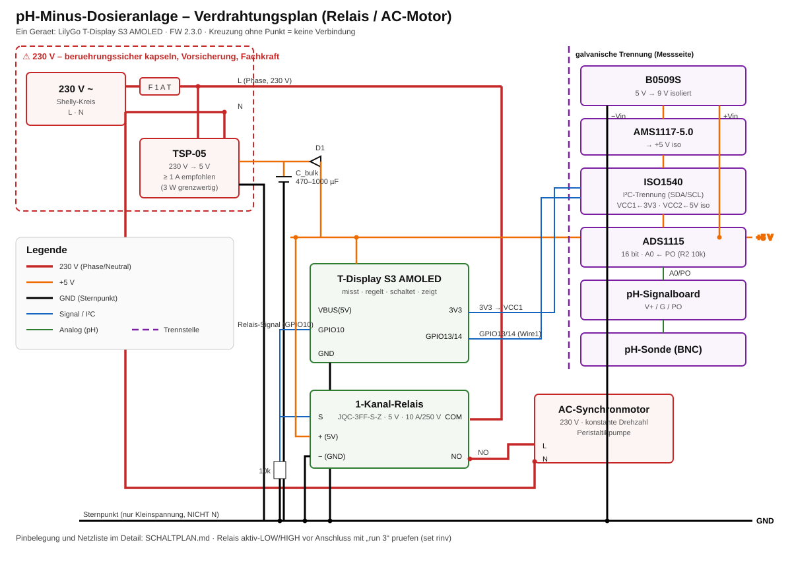
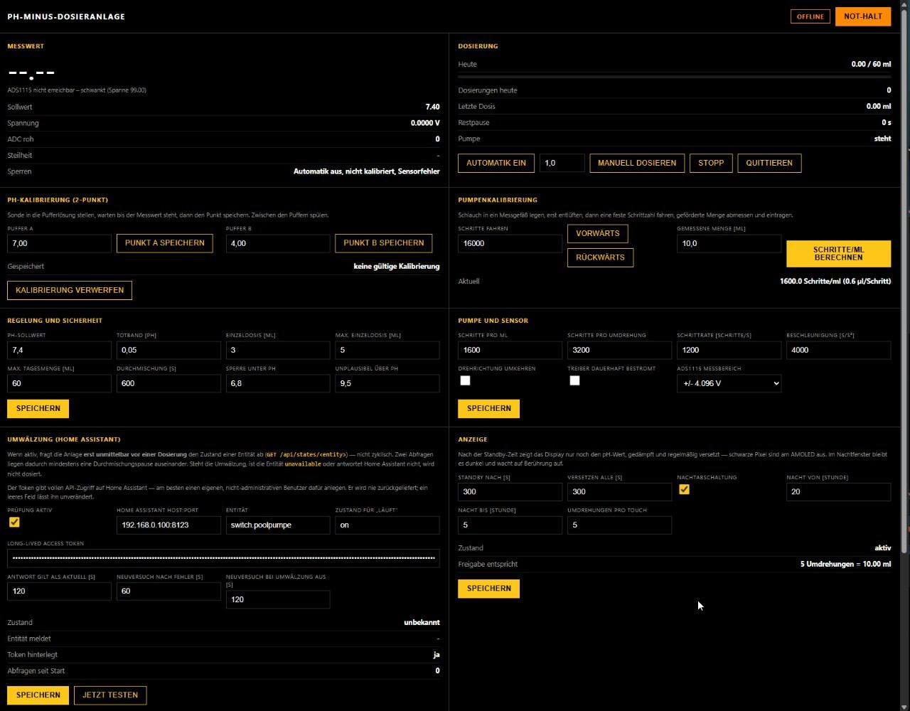

# Automatische pH-Minus-Dosieranlage

LilyGo T-Display S3 AMOLED · ADS1115 · pH-Signalboard · 1-Kanal-Relais · AC-Synchronmotor · Peristaltikpumpe

Umsetzung des Vorhabens aus [ph_minus_dosieranlage_entwicklung.md](ph_minus_dosieranlage_entwicklung.md).

> Jenes Dokument ist die **ursprüngliche Projektbeschreibung** und unverändert
> erhalten. Es geht noch von einem ESP32-C3 Super Mini plus separatem Display
> aus — diese Aufteilung wurde später zugunsten eines einzigen Geräts
> aufgegeben. Verbindlich für den Aufbau sind
> [docs/SCHALTPLAN.md](docs/SCHALTPLAN.md) und
> [docs/LOETANLEITUNG.md](docs/LOETANLEITUNG.md).
> Dosierprinzip, Sicherheitsgrundsätze und Roadmap der Beschreibung gelten
> unverändert.

**Ein Gerät für alles:** Das T-Display S3 AMOLED misst den pH-Wert, regelt,
schaltet die Peristaltikpumpe und ist zugleich Anzeige, Touch-Bedienteil und
Webserver.

> **Ab Firmware 2.3.0: Pumpe an Netzspannung.** Die Pumpe ist ein
> **AC-Synchronmotor** (230 V, konstante Drehzahl), der über ein
> **1-Kanal-Relais** nur ein- und ausgeschaltet wird. Die Dosiermenge ergibt
> sich aus der **Laufzeit** (ml/s, per Testlauf kalibriert). TMC2209, NEMA17,
> das 12-V-Netzteil und der Buck-Converter entfallen; ein AC/DC-Modul
> (230 V → 5 V) versorgt die Elektronik. ⚠️ Damit ist Netzspannung im Spiel —
> Aufbau der Netzseite durch eine befähigte Person, siehe
> [docs/SCHALTPLAN.md](docs/SCHALTPLAN.md) und
> [docs/LOETANLEITUNG.md](docs/LOETANLEITUNG.md).


*Das Foto zeigt den **früheren Stepper-Aufbau** (TMC2209 auf der
Treiber-Erweiterungskarte mit Kühlkörper, daneben der Buck-Converter). Im
aktuellen Aufbau sitzen dort das 1-Kanal-Relais und ein AC/DC-Netzteil; die
Messkette (pH-Signalboard mit BNC, ADS1115, T-Display S3 AMOLED) bleibt gleich.*

Der Peristaltikkopf ist ein 3D-Druckteil: [V2 Peristaltische Pumpe von
Max Puschmann](https://makerworld.com/de/models/2225892-v2-peristaltic-pump-water-pump-measuring-pump), CC BY.
Die STL liegt unter [hardware/pumpe/](hardware/pumpe/) mit bei. Der Kopf war
ursprünglich für die 5-mm-Welle des NEMA17 gezeichnet — für den
AC-Synchronmotor müssen Wellenaufnahme und Halter an dessen Welle/Flansch
angepasst werden, siehe [hardware/README.md](hardware/README.md).



*Verdrahtungsplan — als Datei: [docs/schaltplan.svg](docs/schaltplan.svg),
Netzliste und Pinbelegung in [docs/SCHALTPLAN.md](docs/SCHALTPLAN.md).*

Was sonst noch gebraucht wird und was es ungefähr kostet, steht in
[docs/TEILELISTE.md](docs/TEILELISTE.md) — in Summe rund **239 €**.

---

## Inhalt

```text
firmware/ph_dosieranlage_s3/ die komplette Firmware (Messung, Regelung, UI, Web)
tools/i2c_adc_test/          Phase 1: I²C-Scan und ADS1115-Rohwerte
tools/relay_test/            Relaistest: Schaltlogik (aktiv-LOW/HIGH) prüfen
docs/TEILELISTE.md           Teileliste mit Kostenübersicht
docs/FLASHEN.md              Board-Einstellungen, arduino-cli, OTA
docs/LOETANLEITUNG.md        Schritt für Schritt löten, mit Prüfpunkten
docs/SCHALTPLAN.md           Netzliste, Pinbelegung, offene Messpunkte
docs/schaltplan.svg          Verdrahtungsplan als Grafik
docs/bilder/                 Fotos vom Aufbau, Screenshot der Weboberfläche
docs/INBETRIEBNAHME.md       Phasen 1–7, Kalibrierung, Konsolenbefehle
docs/BEDIENPANEL.md          Display und Touch-Bedienung
docs/HOMEASSISTANT.md        REST-Anbindung an Home Assistant
homeassistant/               fertiges HA-Package und Dashboard-Karte
hardware/                    STL des Pumpenkopfs, Motordatenblatt
scripts/                     build / flash / ota / monitor (PowerShell)
```

---

## Schnellstart

Ausführlich samt Board-Einstellungen der Arduino IDE:
[docs/FLASHEN.md](docs/FLASHEN.md).

```bash
powershell -File scripts/build.ps1
```

```bash
powershell -File scripts/flash.ps1
```

```bash
powershell -File scripts/monitor.ps1
```

In der Konsole (115200 Baud) `help` eingeben.

Board: `esp32:esp32:esp32s3` mit 16 MB Flash, OPI PSRAM und USB-CDC · Port `COM6`

> Der erste Build dauert rund 20 Minuten — LVGL sind ~450 Übersetzungseinheiten,
> und die Skripte bauen mit `--jobs 1`. Grund dafür in
> [docs/BEDIENPANEL.md](docs/BEDIENPANEL.md), Abschnitt 4.

Die Skripte finden die in der Arduino IDE 2 gebündelte `arduino-cli`
automatisch; eine separate Installation ist nicht nötig.

---

## Abhängigkeiten

Getestet ist genau diese Kombination — Installation und Begründung in
[docs/FLASHEN.md](docs/FLASHEN.md):

| Komponente | Version | |
|---|---|---|
| ESP32-Core `esp32:esp32` | **3.3.8** | Espressif, nicht `arduino:esp32` |
| LilyGo-AMOLED-Series | **1.2.4** | Display, Touch, Power |
| lvgl | **8.4.0** | nicht auf 9.x heben |
| SensorLib | **0.3.3** | 0.4.1 ist defekt |
| XPowersLib | **0.3.3** | kommt mit LilyGo-AMOLED-Series |
| arduino-cli | 1.5.1 | in der Arduino IDE 2 enthalten |

Aus dem Core ohne Zusatzinstallation: `WiFi`, `WebServer`, `ESPmDNS`,
`ArduinoOTA`, `HTTPClient`, `Preferences`, `Wire`.

**Zwei Versionen sind festgenagelt, nicht nur getestet:**

* **SensorLib 0.4.1 ist kaputt** — das Release-ZIP liefert ein leeres
  `src/REG/`, wo in 0.3.3 achtzehn Header liegen. Der Build stirbt an
  `REG/BMA423Config.h: No such file or directory`. Kein Fehler auf dieser
  Seite, die Datei fehlt schlicht im Paket.
* **lvgl bleibt bei 8.4** — die Oberfläche zoomt einen Canvas über
  `lv_img_set_zoom()`, um den pH-Wert mit rund 136 px darzustellen. In
  lvgl 9 arbeitet diese API anders; das ist Portierungsarbeit, kein
  Versionswechsel.

Bewusst **nicht** benutzt: eine JSON-Bibliothek (Status wird von Hand
gebaut, die HA-Antwort per Textsuche gelesen) und ein fertiger ADS1115-Treiber
(eigener in `Ads1115.cpp`). Die Pumpe braucht ohnehin keine Motor-Bibliothek —
sie wird über ein Relais nur ein- und ausgeschaltet, die Menge ergibt sich aus
der Laufzeit.

---

## Reihenfolge

1. **Löten** nach [docs/LOETANLEITUNG.md](docs/LOETANLEITUNG.md) —
   die Abschnitte bauen aufeinander auf, insbesondere gilt: `PO` messen
   *bevor* es an den ADS1115 geht, und die **230-V-Seite zuletzt** (durch
   eine befähigte Person).
2. **Tests** mit den Testsketches: I²C/ADS (`-Sketch i2c`) und die
   Relais-Schaltlogik (`-Sketch relay`, mit abgezogener Pumpe).
3. **Phase 3–5** mit der Hauptfirmware:
   Förderrate (ml/s) kalibrieren → pH kalibrieren → Regelung scharf schalten.
4. **Phase 6–7**: WLAN, Webinterface, Bedienpanel, optional Home Assistant.

Details in [docs/INBETRIEBNAHME.md](docs/INBETRIEBNAHME.md).

---

## Firmware-Aufbau

| Modul | Aufgabe |
|---|---|
| `Config.h` | Pinbelegung und **harte** Sicherheitsgrenzen |
| `Ads1115.*` | eigener, abhängigkeitsfreier ADS1115-Treiber |
| `PHMeasurement.*` | Abtastung, Median + EMA, gleitender Mittelwert, 2-Punkt-Kalibrierung |
| `RelayPump.*` | Relais ein/aus über GPIO, Menge aus Laufzeit (ml/s), Laufzeitüberwachung |
| `PHController.*` | Zustandsautomat, Verriegelungen, Tages-/Gesamtzähler |
| `Settings.*` | Persistenz im NVS, Begrenzung aller Werte |
| `WebInterface.*` | WLAN/AP, Webserver, JSON-API, OTA |
| `WebPage.h` | Weboberfläche als ein HTML-Dokument im Flash |
| `PanelUi.*` | LVGL-Oberfläche, Rückfrage, Standby und Nachtmodus |
| `History.*` | 7-Tage-Verlauf in Stundenauflösung, im NVS gesichert |

Anzeige: pH-Wert in ~136 px Höhe, dosierte Menge der letzten 24 Stunden,
Zustand und Sperrgründe. Tippen aufs Display öffnet die Rückfrage, erst
*FREIGEBEN* löst eine Dosierung über eine feste Dosis (ml) aus.

Nach der Standby-Zeit zeigt das Display nur noch den pH-Wert, gedimmt und
regelmäßig versetzt; im Nachtfenster bleibt es ganz dunkel und wacht auf
Berührung auf. Zeiten sind im Webinterface einstellbar. Details in
[docs/BEDIENPANEL.md](docs/BEDIENPANEL.md).



*Die Weboberfläche: zwei Spalten über die volle Breite, Messwert und
Dosierung oben, darunter Kalibrierung, Grenzwerte, Umwälzprüfung und
Anzeigeeinstellungen. Das Bild zeigt einen Stand ohne Sonde — daher „ADS1115
nicht erreichbar" — und noch ohne die Karte „Verlauf 7 Tage", die später
dazukam.*

### Dosierprinzip

```text
messen → plausibilisieren → eine kleine definierte Dosis
      → warten und durchmischen → neu messen → ggf. erneut dosieren
```

Es wird nie „auf den Sollwert durchdosiert". Die Menge ergibt sich aus der
**Laufzeit** der Pumpe (Laufzeit × ml/s). Da eine Dosis über mehrere Sekunden
läuft, fällt ein kurzes Bremsen durch den WLAN-Stack nicht ins Gewicht; die
Laufzeit wird in der Hauptschleife überwacht und hart auf 180 s begrenzt.

Entschieden wird **nach dem gleitenden Mittelwert**, nicht nach dem
Momentanwert. Eine pH-Sonde im strömenden Wasser rauscht; ein einzelner
Ausreißer nach unten würde sonst eine unnötige Dosierung auslösen, ein
Ausreißer nach oben eine überflüssige. Zwei Zeiten sind einstellbar:

| Wert | Vorgabe | Wirkung |
|---|---|---|
| Filterzeit | 30 s | Zeitkonstante der Messwertglättung (angezeigter pH) |
| Mittelung | 600 s | Fenster, aus dem die Regelgröße gebildet wird |

Der Mittelwert entsteht aus einem Ringpuffer mit einem Wert alle 10 s, also
bis zu 60 Minuten. Solange das Fenster nach einem Neustart noch nicht gefüllt
ist, gilt die Sperre *instabil* — das ist der sichere Zustand.

### Verlauf und Chart

Das Webinterface zeigt einen 7-Tage-Chart: pH-Linie, Schwankungsband
(Minimum/Maximum der Stunde) und die dosierte Menge je Stunde als Balken,
dazu die Tagessummen. Gespeichert wird bewusst **ein Datensatz pro Stunde**
statt Einzelmesswerten — 168 Slots zu 10 Byte, rund 1,7 kB. Das überlebt
einen Neustart im NVS, liefert den ganzen Verlauf in einer Antwort und
belastet weder Flash noch Browser.

### Sicherheitsgrenzen (nicht abschaltbar)

max. 20 ml Einzeldosis · max. 500 ml/Tag · max. 180 s Pumpenlauf am Stück ·
min. 60 s Pause · nie unter pH 6,20 · gültiger pH nur zwischen 3,00 und 11,00.

Die Automatik lässt sich ohne gültige Kalibrierung nicht einschalten.
Sensorfehler, instabiler Messwert oder Not-Halt verhindern beziehungsweise
brechen eine Dosierung ab. Tages- und Gesamtmenge überleben einen Neustart.

Für die Umwälzung gibt es bewusst keinen verdrahteten Eingang. Entweder hängt
die Anlage am selben geschalteten Stromkreis wie die Poolpumpe — dann kann sie
physisch nicht in stehendes Wasser dosieren — oder sie fragt unmittelbar vor
jeder Dosierung eine Home-Assistant-Entität ab.

---

## Home Assistant

Die Anbindung liegt fertig bei und braucht keine zusätzliche Software — kein
MQTT, keine Custom Integration. Ein REST-Aufruf alle 30 Sekunden versorgt
alles:

* [homeassistant/ph_dosieranlage.yaml](homeassistant/ph_dosieranlage.yaml) —
  Package mit 17 Sensoren, 6 Binärsensoren, 7 Befehlen, einem Schalter für
  die Automatik und drei Skripten
* [homeassistant/dashboard_karte.yaml](homeassistant/dashboard_karte.yaml) —
  passende Lovelace-Karte
* [docs/HOMEASSISTANT.md](docs/HOMEASSISTANT.md) — Einbau, API-Endpunkte,
  Automationsvorschläge

Den Verlauf muss niemand übertragen: sobald die Sensoren existieren, führt
Home Assistant seine eigene Historie in voller Auflösung. Der 7-Tage-Chart im
Webinterface bleibt davon unabhängig und funktioniert auch, wenn HA steht.

In die Gegenrichtung fragt die Anlage vor jeder Dosierung eine HA-Entität ab
(`switch.poolpumpe`), um sicherzugehen, dass umgewälzt wird. Beides zusammen
ist bewusst kein Kreisverkehr: HA beobachtet und darf abschalten, geregelt
wird in der Firmware — dort greift die Logik auch, wenn das WLAN weg ist.

---

## Lizenz

Firmware, Skripte und Dokumentation stehen unter der
[MIT-Lizenz](LICENSE) — © 2026 Alex Prohaska.

**Zwei Dateien im Repository gehören anderen und stehen ausdrücklich nicht
unter MIT:**

| Datei | Urheber | Lizenz |
|---|---|---|
| `hardware/pumpe/Peristaltic_Pump_V2.stl` | Max Puschmann | [CC BY](https://creativecommons.org/licenses/by/4.0/deed.de) |
| `hardware/datenblaetter/Steppermotor_DE.pdf` | Hersteller des Schrittmotors | Herstellerdokument |

Details in [hardware/README.md](hardware/README.md).

> **Keine Gewähr.** Die MIT-Lizenz schließt jede Haftung aus, und das ist hier
> keine Formalie: Die Anlage dosiert Säure. Wer sie nachbaut, verantwortet
> Auslegung, Aufbau und Betrieb selbst. Die Sicherheitsgrenzen in der Firmware
> sind eine zweite Verteidigungslinie, nicht die erste — die ist der Aufbau
> nach [docs/LOETANLEITUNG.md](docs/LOETANLEITUNG.md), inklusive Sicherung,
> Impfventil und säurebeständigem Schlauch.

---

## Offene Punkte aus der Projektbeschreibung

Diese Werte lassen sich nicht am Schreibtisch festlegen und sind in den
Dokumenten als Messpunkte markiert:

* Versorgungsspannung und tatsächlicher `PO`-Bereich des pH-Boards
  → [docs/SCHALTPLAN.md](docs/SCHALTPLAN.md), Abschnitt 5
* Schaltlogik des Relaismoduls (aktiv-LOW/HIGH) → mit `-Sketch relay` bzw.
  `run 3` prüfen, `set rinv` setzen → Lötanleitung, Abschnitt 8
* Wellen-/Flanschmaße des AC-Motors für die Pumpenkopf-Aufnahme
  → [hardware/README.md](hardware/README.md)
* Förderrate `ml/s` aus einem Testlauf → Inbetriebnahme, Phase 3
* Sichere Dosiergrenzen für das konkrete Beckenvolumen → Inbetriebnahme, Phase 5

Der säurebeständige Schlauch und die Anpassung des Pumpenkopfs an den AC-Motor
stehen laut Projektstand noch aus. Für die Firmware ist das unkritisch — die
Förderrate `ml/s` ist ein Kalibrierwert und wird in Phase 3 ermittelt.
