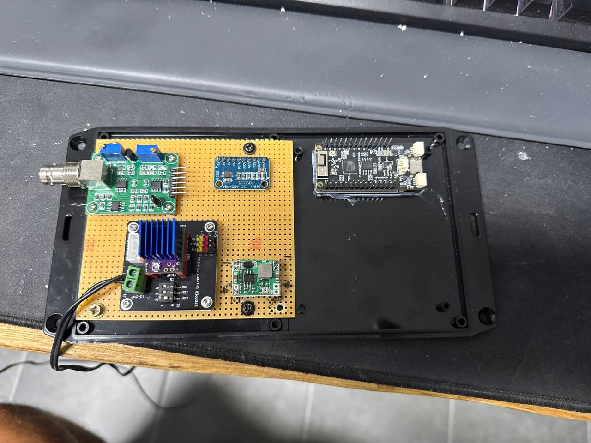
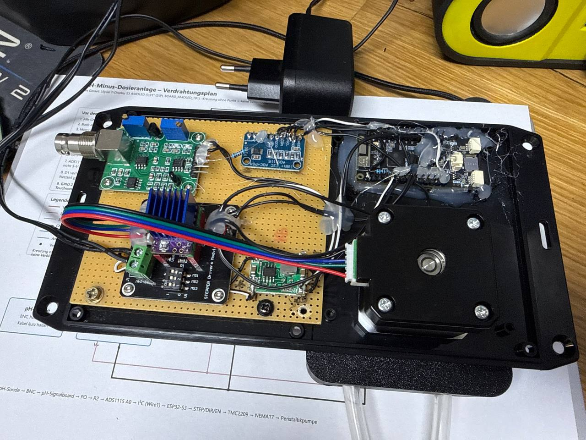

# Lötanleitung — pH-Minus-Dosieranlage

Begleitend: [SCHALTPLAN.md](SCHALTPLAN.md) und [schaltplan.svg](schaltplan.svg).

Steuerung ist der **LilyGo T-Display S3 AMOLED** — er misst, regelt, schaltet die
Pumpe und ist gleichzeitig Anzeige und Bedienteil. Ein separater ESP32-C3 kommt
nicht mehr vor.

> **Ab Firmware 2.3.0: Pumpe an Netzspannung.** Die Pumpe ist ein
> **AC-Synchronmotor** (230 V), der über ein **1-Kanal-Relais** ein- und
> ausgeschaltet wird. Versorgt wird die Elektronik aus einem **AC/DC-Netzteil
> 230 V → 5 V** (TSP-05 o. ä.). TMC2209, NEMA17, 12-V-Netzteil und Buck-Converter
> entfallen. Verdrahtet werden Stromversorgung, ADS1115, Relais und Motor.

Display und Touch sind auf dem Board integriert: dafür ist **nichts zu löten**.
Die Reihenfolge ist bewusst so gewählt, dass nach jedem Abschnitt geprüft werden
kann, bevor mehr Spannung ins Spiel kommt. **Bitte nicht vorgreifen** —
insbesondere kommt die Netzseite (230 V) erst ganz zum Schluss.

---

## 0. Sicherheit zuerst

**⚠️ Netzspannung (230 V)**

Dieser Aufbau schaltet 230 V direkt. Das ist der wichtigste Unterschied zum
früheren 12-V-Aufbau:

* Die **Netzseite gehört in die Hand einer elektrotechnisch befähigten Person.**
  Im Zweifel eine Fachkraft hinzuziehen — 230 V sind lebensgefährlich.
* Nur mit **gezogenem Netzstecker** arbeiten. Nicht „nur ausgeschaltet".
* **Vorsicherung (träge, 1 A)** in die Phase, vor TSP-05 und Relais.
* Alles Netzführende (L, N, Relaiskontakte, TSP-05-Eingang, Motorleitung) in ein
  **geschlossenes, berührungssicheres Gehäuse** mit Zugentlastung. Zur
  Kleinspannung **mind. 3 mm Luft- und Kriechstrecke** halten; 230-V- und
  5-V-Verdrahtung räumlich trennen.
* Netzleitung in **H05VV-F / 0,75 mm²** (oder kräftiger), keine dünne Signallitze
  für 230 V.
* Schutzleiter (PE) anschließen, wo Motor/Aufbau ihn vorsehen.

**Elektronisch (Kleinspannung)**

* Elkos richtig herum: Minusseite ist am Gehäuse markiert.
* Reihenfolge einhalten — die isolierte Messseite verträgt keine verschleppte
  Masse.

**Chemisch (später bei der Inbetriebnahme)**

* pH-Minus ist Säure. Schutzbrille und Handschuhe.
* pH-Minus **niemals** mit Chlorprodukten mischen — es entsteht Chlorgas.
* Der Säurebehälter steht **tiefer als die Pumpe**, damit bei einem
  Schlauchdefekt nichts nachlaufen kann.
* Am Einspritzpunkt gehört ein **Rückschlagventil**, damit kein Poolwasser
  in die Dosierleitung zurückdrückt.
* Der Schlauch muss säurebeständig sein (Norprene/Tygon für Chemie,
  **kein** Silikon — Silikon quillt und wird von Säure angegriffen).

---

## 1. Werkzeug und Material

**Werkzeug**

* Lötkolben mit temperaturgeregelter Spitze, 320–350 °C
* Lötzinn 0,7–1,0 mm (bleihaltig lötet sich für Handarbeit deutlich einfacher)
* Seitenschneider, Abisolierzange, Pinzette
* Multimeter (Durchgangsprüfer, DC-Spannung, Widerstand)

**Material**

Preise und die vollständige Liste inklusive Hydraulik und Chemie stehen in
[TEILELISTE.md](TEILELISTE.md).

| Pos | Teil | Menge |
|---|---|---|
| 1 | Lochrasterplatine 100 × 80 mm, RM 2,54 | 1 |
| 2 | Stift-/Buchsenleiste passend zum Header des S3 AMOLED | 1 Satz |
| 3 | Buchsenleiste 1×10 (für ADS1115) | 1 |
| 4 | 1-Kanal-Relaismodul, 5-V-Spule (JQC-3FF-S-Z), Header `S·+·−` | 1 |
| 5 | AC/DC-Netzteil 230 V → 5 V, **≥ 1 A** (TSP-05 grenzwertig, HLK-10M05 besser) | 1 |
| 6 | AC-Synchronmotor 230 V (Peristaltik) | 1 |
| 7 | Schraubklemme Kleinspannung (pH-Board, Reserve) | 2 |
| 8 | **Netzspannungsfeste Klemmen** für L, N, Motor | 1 Satz |
| 9 | Elko **470–1000 µF / 25 V** (**C_bulk**) + 100 nF | 1 Satz |
| 10 | Widerstand 10 kΩ (**Pulldown** am Relais-`S`) | 1 |
| 11 | Widerstand 10 kΩ (**R2**, Schutz vor A0) | 1 |
| 12 | Schottky-Diode SS34 oder 1N5819 (**D1**) | 1 |
| 13 | Litze 0,25 mm² (Signal) + **H05VV-F 0,75 mm² (230 V)** | je 1 m |
| 14 | Schrumpfschlauch-Sortiment | 1 |
| 15 | Sicherungshalter + Feinsicherung **1 A träge** (Netzseite) | 1 |
| 16 | Gehäuse, berührungssicher, mit Sichtfenster | 1 |
| 17 | I²C-Isolator ISO1540/ISO1541 als Modul | 1 |
| 18 | Isolierter DC-DC 5 → 9 V, 1 W (**B0509S-1W**) | 1 |
| 19 | Linearregler AMS1117-5.0 | 1 |
| 20 | Elko 10 µF und 22 µF, 2× 100 nF (Filter isolierte Seite) | 1 Satz |
| 21 | Ferritperle für die isolierte 5-V-Zuleitung | 1 |

> **Das 5-V-Netzteil sollte mindestens 1 A liefern.** Es versorgt Displayboard,
> Relaisspule und die isolierte Messseite gemeinsam. Ein knappes 3-W-Modul
> (600 mA) wie das TSP-05 ist grenzwertig — ohne kräftigen Stützkondensator
> bricht die 5-V-Schiene beim WLAN-Senden oder beim Anziehen des Relais ein und
> der ESP32 startet neu.

> **Buchsenleiste statt Direktlöten für den ADS1115.** Der ADS1115 wird
> gesteckt, nicht eingelötet. Auch zum Displayboard und zum Relaismodul führen
> nur wenige Adern — die kommen an steckbare Verbindungen, damit die Module für
> Reparaturen frei werden.

---

## 2. Baugruppe A — Platine vorbereiten



*(Das Foto zeigt den **früheren Stepper-Aufbau** mit TMC2209 und Buck-Converter.
Die Messkette links/oben — pH-Board mit BNC, ADS1115, T-Display S3 AMOLED —
bleibt gleich; anstelle von Treiber und Buck sitzen jetzt Relaismodul und
AC/DC-Netzteil.)*

1. Platine so ausrichten, dass später gilt: **Netzseite (TSP-05, Relais, Motor)
   auf einer Seite, Messkette auf der anderen.** Das hält Netzspannung und
   Störungen von der hochohmigen Messkette fern.
2. Die Buchsenleiste für den ADS1115 probeweise bestücken und die Position
   anzeichnen. Das Displayboard und das Relaismodul sitzen nicht fest auf der
   Lochrasterplatine, sondern werden über steckbare Leitungen angebunden.
3. Buchsenleisten löten: erst **je einen Eckpin** anlöten, Ausrichtung prüfen
   (Leiste muss plan aufliegen), dann die restlichen Pins.
4. Klemmen/Steckverbinder einlöten:
   * KL_pH (Kleinspannung, 3-polig): pH-Board (V+, G, PO)
   * KL_disp (Stiftleiste): Leitung zum Displayboard
     (5 V, GND, 3V3, Relais-`S`, SDA, SCL)
   * KL_relay (Stiftleiste 3-polig): zum Relais-Header `S · + · −`
   * **Netzklemmen** (getrennter, berührungssicherer Bereich): L, N, Motor
5. **GND-Sternpunkt** anlegen: ein kräftiger Lötpunkt etwa mittig auf der
   Kleinspannungsseite. Alle Kleinspannungs-Massen laufen dorthin — **nicht** der
   Netz-Neutralleiter N.

**Prüfen:** Durchgangsprüfer zwischen benachbarten Pins jeder Buchsenleiste —
darf **nirgends** piepen. Lötbrücken jetzt finden, nicht später.

---

## 3. Baugruppe B — 5-V-Versorgung aus dem AC/DC-Netzteil

> ⚠️ **Die 230-V-Seite des TSP-05 wird erst in Abschnitt 10 gemeinsam mit dem
> Motor verdrahtet — und von einer befähigten Person.** Hier geht es nur um die
> 5-V-Ausgangsseite.

1. TSP-05 provisorisch (durch eine Fachkraft, im Gehäuse) mit 230 V versorgen und
   den Ausgang messen: **`+Vo` gegen `−Vo` ≈ 5,0 V.** Danach wieder spannungsfrei.
2. `−Vo` an den **GND-Sternpunkt**.
3. **C_bulk (470–1000 µF)** direkt zwischen `+Vo` und `−Vo`, dazu ein 100 nF
   parallel. Plus an `+Vo`, Minus (markiert) an GND. Der Elko fängt die
   WLAN- und Relais-Stromspitzen ab.
4. `+Vo` über **D1** (Schottky, Ring/Kathode Richtung Display) auf die
   Kleinspannungs-5-V-Schiene.
5. Von der 5-V-Schiene (hinter D1) gehen ab:
   * KL_disp `5V` → Displayboard `VBUS`
   * Relais `+`
   * B0509S `+Vin` (Messseite, Abschnitt 6)

**Prüfen:** Nach dem Einschalten (nur TSP-05, Displayboard noch nicht
angeschlossen) muss an D1-Kathode gegen GND ca. **4,6–4,8 V** liegen
(5,0 V minus Diodenspannung).

Die 5 V gehen auf ein **`VBUS`**-Pad der linken Stiftleiste (dort gibt es zwei
davon, direkt über `GPIO16`). `VBUS` liegt board-intern parallel zur 5-V-Schiene
des USB-C-Anschlusses — genau deshalb sitzt D1 in der Zuleitung. Der
Akkuanschluss bleibt frei.

---

## 4. Baugruppe C — Relais anbinden (Steuerseite)

Mit 0,25 mm² Litze, möglichst kurz:

| Von | Nach | Farbvorschlag |
|---|---|---|
| S3 `GPIO10` | Relais `S` | weiß |
| 5-V-Schiene | Relais `+` | rot |
| GND-Sternpunkt | Relais `−` | schwarz |

Dann die eine Ergänzung:

5. **10 kΩ Pulldown** von Relais-`S` nach GND. Damit bleibt die Spule stromlos,
   solange der ESP32 bootet oder im Reset hängt — ohne diesen Widerstand könnte
   ein floatender `S`-Pin das Relais unkontrolliert anziehen.

> **Das Relais-`+` gehört an 5 V, nicht an 3,3 V.** Die 5-V-Spule zieht erst ab
> ~3,75 V sicher an. Nur das **Signal** `S` kommt vom 3,3-V-GPIO.

Die früheren Signaladern STEP/DIR/EN entfallen; `GPIO11`, `GPIO12` und `GPIO15`
bleiben frei.

**Prüfen:**
* `S` ↔ GND: ca. 10 kΩ (der Pulldown).
* `+` ↔ 5-V-Schiene: Durchgang. `−` ↔ Sternpunkt: Durchgang.

---

## 5. Baugruppe D — isolierte Messseite

**Die gesamte Messkette liegt hinter einer galvanischen Trennstelle.** Das ist
keine Verfeinerung, sondern Voraussetzung: eine pH-Elektrode hat bis zu 250 MΩ
Innenwiderstand, und der Ableitstrom des Netzteils sucht seinen Weg zur Erde
durch genau diese Elektrode. Gemessen an einem vergleichbaren Aufbau waren es
**712 mV Messspanne am Netzteil gegen 0,7 mV an einer Powerbank** — Faktor
tausend. Ohne Trennung ist die Anlage im Becken nicht kalibrierbar. Hergang in
[INBETRIEBNAHME.md](INBETRIEBNAHME.md).

### 5.1 Isolierte Versorgung

1. **Zweiten Massepunkt anlegen.** Ein eigener Lötstützpunkt, mit deutlichem
   Abstand zum Sternpunkt, am besten optisch als eigener Bereich markiert.
   Er heißt ab hier `GND iso`.
2. `B0509S` `+Vin` an die 5-V-Schiene (D1-Kathode), `−Vin` an den
   **Sternpunkt**. Das ist die letzte Verbindung zur netzbezogenen Seite.
3. `B0509S` `−Vout` an `GND iso`, `+Vout` an `AMS1117-5.0` `IN`.
   **10 µF direkt am Wandlerausgang.**
4. `AMS1117` `GND` an `GND iso`, `OUT` über die **Ferritperle** auf die
   isolierte 5-V-Schiene. **22 µF und 100 nF am Reglerausgang**, dazu je
   100 nF direkt an pH-Board und ADS1115.

> **Kein B0505S.** Ein ungeregelter 1-W-Wandler liefert bei den hier benötigten
> rund 25 mA — 12 % seiner Nennlast — eher 5,5 bis 6 V. Der ADS1115 verträgt
> maximal 5,5 V. Der Umweg über 9 V und den Linearregler kostet 50 Cent und
> nimmt diese Unsicherheit heraus.

### 5.2 Isolator

5. `ISO1540` `VCC1` an S3 `3V3`, `GND1` an den **Sternpunkt**.
6. `ISO1540` `SDA1` an S3 `GPIO13`, `SCL1` an S3 `GPIO14` — das ist der
   **zweite** I²C-Bus (`Wire1`). Der Touchcontroller des Displays hat seinen
   eigenen Bus auf GPIO2/3; der bleibt unangetastet.
7. `ISO1540` `VCC2` an die isolierte 5-V-Schiene, `GND2` an `GND iso`.
8. `ISO1540` `SDA2`/`SCL2` an ADS1115 `SDA`/`SCL`.

> **Pull-ups auf Seite 1 nicht vergessen.** Bringt das Isolatormodul auf Seite 1
> keine mit, gehören dort **je 4,7 kΩ von SDA und SCL nach 3,3 V** hin — sonst
> bleibt der Bus tot und es sieht aus wie ein defekter Isolator.

### 5.3 ADS1115

9. `VDD` des ADS1115-Sockels an die **isolierte 5-V-Schiene**, `GND` an
   `GND iso`. pH-Board und ADS1115 **müssen** auf derselben Schiene liegen,
   sonst arbeiten die Pull-ups des Breakouts gegen einen anderen Pegel.
10. `ADDR` an `GND iso` (I²C-Adresse 0x48).
11. **R2 (10 kΩ)** von KL_pH `PO` zum ADS1115-Sockel `A0`. Direkt an der Klemme
    anlöten, Verbindung zu `A0` kurz halten. R2 liegt vollständig auf der
    isolierten Seite.
12. `A1`, `A2`, `A3` bleiben frei.

**Prüfen — am LEEREN Sockel, bevor der Chip hineinkommt:**

> * `VDD` gegen `GND iso`: **5,0 V ± 0,1** vom AMS1117. Nicht 9 V.
> * Messspitzen tauschen: der Wert muss negativ werden (Versorgung/Masse nicht
>   verpolt).
> * Anlage ausschalten, dann erst das Modul stecken.

Danach, stromlos:
* **`GND iso` ↔ Sternpunkt: KEIN Durchgang.** Das ist die eine Messung, die über
  Erfolg oder Misserfolg des ganzen Aufbaus entscheidet. Dasselbe zwischen
  isolierter und netzbezogener 5-V-Schiene.
* `VDD` ↔ `GND iso` am ADS-Sockel: **kein** Durchgang.
* KL_pH `PO` ↔ ADS `A0`: ca. 10 kΩ.
* `SDA1` ↔ 3,3 V am Isolator: ca. 4,7–10 kΩ. „Unendlich" → Pull-ups auf Seite 1
  fehlen.

---

## 6. Erster Funktionstest — nur Logik, keine Netzspannung

1. **TSP-05 nicht an 230 V.** Motor nicht angeschlossen.
2. ADS1115 in den Sockel stecken, Displayboard anschließen (GND, 3V3, SDA, SCL),
   Relaismodul über `S·+·−` anbinden.
3. Displayboard nur per **USB-C** mit dem PC verbinden (versorgt Logik und
   Relaisspule über die 5-V-Schiene).
4. Testsketch `tools/i2c_adc_test` flashen (siehe [INBETRIEBNAHME.md](INBETRIEBNAHME.md),
   Phase 1).
5. Im seriellen Monitor muss `0x48` erscheinen (ADS1115).

Kommt hier nichts, liegt es fast immer an: SDA/SCL vertauscht, GND fehlt, VDD
fehlt, oder Pull-ups fehlen. Der Touchcontroller `0x15` liegt auf dem **anderen**
Bus (GPIO2/3) und taucht in diesem Scan nicht auf — das ist richtig so.

---

## 7. pH-Board messen und anschließen

**Erst jetzt** wird das pH-Board mit Spannung versorgt — zunächst auf dem Tisch.

1. Aufdruck des Boards lesen: 5 V oder 3,3–5 V?
2. Board provisorisch mit der passenden Spannung versorgen, `G` an GND.
3. pH-Sonde anstecken, in **pH-7-Pufferlösung** stellen, 2 Minuten warten.
4. `PO` gegen `G` messen und notieren: ____ V
5. Sonde spülen, in **pH-4-Pufferlösung**, 2 Minuten warten, `PO` messen: ____ V
6. Auswerten:
   * Beide Werte ≤ 3,2 V → `PO` direkt an KL_pH anschließen.
   * Ein Wert > 3,2 V → Spannungsteiler ergänzen (10 kΩ = R2 plus 20 kΩ nach
     GND iso). Die Kalibrierung rechnet den Faktor automatisch heraus.
7. pH-Board an KL_pH verdrahten: `V+` (an +5 V iso), `G` (an GND iso), `PO`.

**Kabelführung:** Das BNC-Kabel der Sonde und die Leitung zum pH-Board möglichst
kurz halten und mit **mindestens 10 cm Abstand** zu Netz- und Motorleitungen
verlegen. Das Sondensignal ist hochohmig und fängt Störungen sonst zuverlässig
ein.

---

## 8. Relais und Pumpe testen — noch OHNE Netzspannung am Motor

**Zuerst die Schaltlogik klären, mit abgezogener Pumpe.** Das Relaismodul
(KY-019, Header `S·+·−`) hat keinen Optokoppler und ist typischerweise
**aktiv-HIGH**.

1. Nur USB/5 V, **Motorklemme frei** (kein 230 V am Relaiskontakt).
2. Hauptfirmware flashen, serielle Konsole öffnen.
3. `run 3` eingeben. Das Relais muss hörbar **anziehen (Klick + LED)** und nach
   3 Sekunden **von selbst abfallen**.
   * Zieht es **verkehrt** an (Ruhe = angezogen, oder schon beim Booten) →
     `set rinv 1` (aktiv-HIGH) und erneut `run 3`. Alternativ „Relais
     invertieren" im Webinterface.
4. Ergebnis merken: Das Relais darf im Ruhezustand **nicht** angezogen sein.

**Prüfen:** Beim Booten und im Ruhezustand ist die Relais-LED **aus**. Der
10 kΩ Pulldown und die richtige `rinv`-Einstellung sichern das ab.

---

## 9. Förderrate kalibrieren (mit Wasser)

Kommt der Motor über das Relais an Netzspannung (Abschnitt 10), wird die
Förderrate bestimmt. **Mit Wasser, nicht mit Säure.** Vorgehen und Formel stehen
in [INBETRIEBNAHME.md](INBETRIEBNAHME.md), Phase 3 — kurz:

1. Saug-/Druckschlauch einlegen, Saugseite ins Wasserglas.
2. Entlüften: `run 30`, bis blasenfrei Wasser kommt.
3. Definierte Zeit fahren: `run 60`, geförderte Menge messen (z. B. 9,4 ml).
4. `mlps 60 9.4` → Firmware speichert die Förderrate (ml/s).
5. Gegenprobe: `dose 5` → es müssen ca. 5 ml kommen.

---

## 10. Netzseite verdrahten — durch eine befähigte Person

> ⚠️ **230 V. Spannungsfrei arbeiten, im Gehäuse, mit Vorsicherung.** Dieser
> Abschnitt beschreibt nur die Verbindungspunkte — die fachgerechte Ausführung
> (Klemmen, Zugentlastung, Kriechstrecken, PE) liegt in der Verantwortung der
> ausführenden Person.

Anschlussplan:

```text
Netz L ──[Sicherung 1 A T]──┬── TSP-05 AC
                            └── Relais COM
Relais NO ───────────────────── Motor L
Netz N ─────────────────────┬── TSP-05 AC
                            └── Motor N
PE ─────────────────────────── Motor/Aufbau (wo vorgesehen)
```

* **COM + NO** verwenden (nicht NC): stromlose Spule = Motor aus.
* TSP-05-Eingang `AC/AC` ist ungepolt (L/N beliebig), der Relaiskontakt schaltet
  aber ausdrücklich die **Phase (L)**.
* Netzführende Adern in **H05VV-F 0,75 mm²**, mit Abstand zur Kleinspannung.

**Prüfen (spannungsfrei):**
* COM ↔ NO: nur Durchgang, wenn das Relais angezogen ist.
* Kein Durchgang zwischen Netzseite und irgendeiner Kleinspannungs-/GND-Ader.

---

## 11. Abschließende Prüfliste vor dem ersten Volllauf

> **Zuerst, stromlos: `GND iso` gegen Sternpunkt auf Durchgang prüfen.**
> Es darf keiner bestehen.

- [ ] Sichtprüfung mit Lupe: keine Lötbrücken, keine kalten Lötstellen
- [ ] 3,3-V-Netz ↔ GND: kein Kurzschluss
- [ ] 5-V-Netz ↔ GND: kein Kurzschluss
- [ ] Netzseite ↔ Kleinspannung/GND: **kein** Durchgang
- [ ] Alle Kleinspannungs-GND am Sternpunkt; N **nicht** am Sternpunkt
- [ ] C_bulk richtig gepolt an der 5-V-Schiene
- [ ] D1 richtig gepolt (Ring zeigt zum ESP32)
- [ ] 10 kΩ Pulldown am Relais-`S`
- [ ] Relais-`+` an 5 V (nicht 3,3 V)
- [ ] `set rinv` so gesetzt, dass Ruhe = Relais aus (via `run 3` verifiziert)
- [ ] Vorsicherung 1 A träge in der Phase
- [ ] 5 V liegen auf `VBUS`, nicht auf `3V3`
- [ ] 5-V-Netzteil ausreichend dimensioniert (Spannung unter WLAN-Last > 4,7 V)
- [ ] Firmware geflasht
- [ ] Nichts an GPIO 2 oder 3 angeschlossen (Touch!)
- [ ] Sondenkabel getrennt von Netz-/Motorleitungen verlegt
- [ ] Netzseite fachgerecht ausgeführt, alles im berührungssicheren Gehäuse

**Einschaltreihenfolge:** immer erst USB/5 V (Logik), dann 230 V.
**Ausschaltreihenfolge:** erst 230 V, dann Logik.

---

## 12. Displayboard einbauen



*(Das Foto zeigt den **früheren Stepper-Aufbau**. Im aktuellen Aufbau sitzen
statt Treiber und Buck das Relaismodul und das AC/DC-Netzteil; die Netzseite ist
räumlich von der Messkette getrennt.)*

Am Board selbst wird nichts gelötet — Display und Touch sind integriert. Es geht
nur um Befestigung und die Anbindung.

1. **Ausschnitt im Gehäusedeckel**: sichtbare Fläche 536 × 240 px auf 1,91 Zoll,
   also rund 43 × 19 mm. Etwas Rand einplanen.
2. Board mit Abstandsbolzen M3 hinter dem Fenster befestigen. **Nicht** auf die
   Rückseite drücken, dort liegen Bauteile.
3. Verbindung zur Lochrasterplatine stecken: `5 V` (hinter D1), `GND`, `3V3`,
   Relais-`S`, `SDA`, `SCL`.
4. Die Leitung so verlegen, dass sie **nicht parallel zu Netz-/Motorleitungen**
   läuft.
5. Den USB-C-Anschluss zugänglich lassen: Weg für Firmware und serielle Konsole.

**Prüfen:** Mit eingeschaltetem Display und angezogenem Relais die 5-V-Spannung
messen. Fällt sie unter 4,7 V, ist das Netzteil zu klein oder C_bulk zu klein.

**Montageort:** Das AMOLED ist nicht für Dauerfeuchte gebaut. Im Technikraum
gehört es in ein Gehäuse mit Sichtfenster, nicht offen an die Wand.

---

## 13. Mechanik und Hydraulik


*(Das Foto zeigt den Pumpenkopf auf dem früheren NEMA17. Am AC-Synchronmotor
sind Wellen-/Flanschmaße anders — Kopfaufnahme und Halter entsprechend anpassen.)*

* Peristaltikkopf auf die **Welle des AC-Synchronmotors**: Wellendurchmesser und
  Abflachung/Passfeder des konkreten Motors messen, Aufnahme darauf auslegen.
  Verwendet wird das 3D-Druckmodell
  [V2 Peristaltic Pump](https://makerworld.com/de/models/2225892-v2-peristaltic-pump-water-pump-measuring-pump);
  die STL liegt unter [../hardware/pumpe/](../hardware/pumpe/). Der V2-Kopf ist
  für eine 5-mm-NEMA17-Welle gezeichnet — für den AC-Motor ggf. Adapter oder
  angepasste Aufnahme.
* Die Pumpe **oberhalb** des Säurebehälters montieren.
* Saugseite: Schlauch mit Fußventil und Ansaugfilter im Kanister.
* Druckseite: Impfventil (Rückschlagventil) im Bypass **nach** Filter und
  Heizung/Wärmepumpe, mit gutem Abstand zur pH-Sonde — sonst misst die Sonde die
  frische Säure statt des Poolwassers und die Regelung schwingt.
* Sonde selbst: in einer Messzelle im Bypass oder mit Sondenhalter im Rücklauf,
  immer **vor** dem Einspritzpunkt.
* Schlauch als Verschleißteil betrachten: Wechselintervall notieren (typisch
  500–1000 Betriebsstunden) und regelmäßig auf Risse prüfen.

---

## 14. Wenn etwas nicht funktioniert

| Symptom | Wahrscheinliche Ursache |
|---|---|
| ADS1115 wird nicht gefunden | SDA/SCL vertauscht, GND fehlt, Pull-ups fehlen, ADDR offen |
| Messwert springt stark | Sondenkabel zu lang/zu nah an Netz-/Motorleitungen, GND nicht sternförmig |
| Messwert driftet langsam | Sonde alt oder ausgetrocknet, Kalibrierung fällig |
| Relais zieht nicht an | `+` an 3,3 V statt 5 V, `rinv` falsch, GPIO10/`S` vertauscht |
| Relais fällt nicht ab / an beim Booten | `rinv` falsch (Board ist aktiv-HIGH) oder Pulldown fehlt |
| Pumpe läuft, aber fördert nichts | Schlauch nicht entlüftet, Kanister leer, Impfventil zu |
| ESP startet neu, wenn das Relais anzieht | C_bulk fehlt/zu klein, Netzteil zu schwach |
| Display startet neu beim WLAN-Senden | Netzteil zu klein, C_bulk zu klein |
| Firmware meldet dauerhaft „Sensorfehler" | pH-Board unversorgt, PO nicht angeschlossen, Spannung außerhalb 0,03–3,25 V |
| Touch reagiert schlecht, seit der ADS1115 dran ist | ADS versehentlich auf dem Touchbus (GPIO2/3) statt auf GPIO13/14 |
| Kein Bild, Konsole meldet „Display init failed" | Boardvariante oder Board-Einstellungen falsch |
| ADS1115 wird heiß oder raucht | Falsche Spannung an `VDD` oder Versorgung verpolt — Chip ersetzen, Ursache vorher finden |
| `Spannung unplausibel`, ADC roh = 0 | `A0` liegt auf GND statt auf `PO`, oder das pH-Board hat keine Versorgung |
