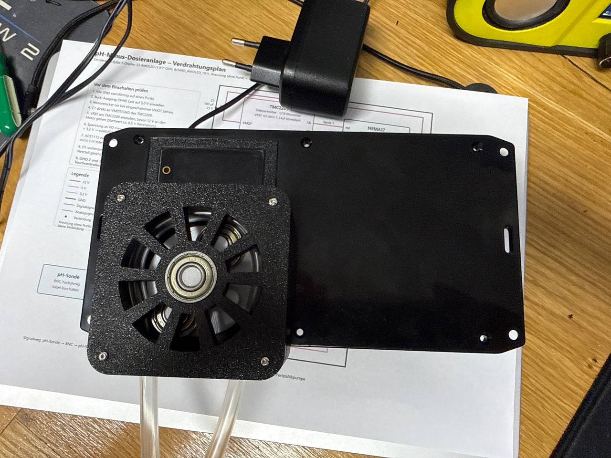

# Hardware — Druckteile und Datenblätter

```text
pumpe/Peristaltic_Pump_V2.stl     Peristaltikkopf, 3D-Druckteil
datenblaetter/Steppermotor_DE.pdf Datenblatt des NEMA17 (deutsch, 18 Seiten)
```

---

## Peristaltikkopf

`pumpe/Peristaltic_Pump_V2.stl` — 7884 Dreiecke, Binär-STL.

**„V2 Peristaltische Pumpe / Wasserpumpe / Dosierpumpe" von Max Puschmann**,
veröffentlicht am 10.01.2026 auf [MakerWorld](https://makerworld.com/de/models/2225892-v2-peristaltic-pump-water-pump-measuring-pump), lizenziert unter
[Creative Commons Attribution (CC BY)](https://creativecommons.org/licenses/by/4.0/deed.de).
Das Modell ist ein Remix einer früheren Peristaltikpumpe desselben Autors.

Die STL liegt hier unverändert mit bei — CC BY erlaubt das Weitergeben
ausdrücklich und verlangt dafür nur die Namensnennung. Die steht in diesem
Absatz.

### Druckparameter des Autors

| | |
|---|---|
| Schichthöhe | 0,2 mm |
| Wandungen | 4 |
| Füllung | 30 Prozent |
| Material | PLA, rund 119 g |
| Druckzeit | etwa 3 h auf 4 Platten |

Zusätzlich nötig: **vier 608-Kugellager** — drei als Rollen im Rotor, eines
in der Wellenaufnahme — und weicher Schlauch für den Pumpenkopf.



*Der gedruckte Kopf montiert: drei Rollenlager im Rotor, in der Mitte das
608er Kugellager der Wellenaufnahme.*

### Verstärkte Wellenaufnahme

Die **V2 des Modells hat eine verstärkte Wellenaufnahme** — genau die Stelle,
an der das gesamte Pumpenmoment vom Motor auf den Rotor übergeht. Beim
Schlauchquetschen ist das kein kleines Moment: der Rotor drückt den Schlauch
über die ganze Umschlingung zusammen, und das Losbrechmoment beim Anfahren
liegt deutlich über dem Dauermoment.

Eine dünn gedruckte Aufnahme leiert dort im Lauf der Zeit aus, die
Madenschraube gräbt sich ein, und die Pumpe fördert dann zu wenig, ohne dass
sich elektrisch etwas ändert — die Firmware zählt weiter exakte Schritte und
verbucht Milliliter, die nie im Becken ankommen. **Das gehört zu den wenigen
Fehlern, die die Firmware nicht bemerken kann** — wie ein leerer Kanister oder
ein gerissener Schlauch: die Pumpe läuft, die Zählung stimmt, gefördert wird
nichts. Auffallen kann so etwas nur daran, dass der pH-Wert trotz Dosierung
nicht nachgibt. Deshalb ist die verstärkte Fassung hier die richtige.

Beim Aufziehen: Wellendurchmesser 5 mm prüfen und die Madenschraube auf die
**Abflachung** der Welle setzen, nicht auf das runde Stück.

Montage und Hydraulik: [../docs/LOETANLEITUNG.md](../docs/LOETANLEITUNG.md),
Abschnitt 13.

Der Schlauch im Kopf ist das Verschleißteil der ganzen Anlage — Norprene oder
Tygon, **kein Silikon** (quillt und wird von Säure angegriffen).

---

## Schrittmotor

`datenblaetter/Steppermotor_DE.pdf` — „Quick Start Anleitung,
Zweiphasen-Hybrid-Schrittmotor 42".

Kennwerte laut Seite 3:

| | |
|---|---|
| Referenz | NEMA17 |
| Strom/Phase | **0,4 A** |
| Schrittwinkel | 1,8° (200 Vollschritte/Umdrehung) |
| Phasen | 2 |
| Nennspannung | 12 V |
| Rahmengröße | 42 × 42 mm, Höhe 34 mm |
| Haltedrehmoment | „28 Nm" (siehe unten) |

### Spulenzuordnung

Seite 5 des Datenblatts, wörtlich:

> Spule A (grünes Kabel, schwarzes Kabel)
> Spule B (rotes Kabel, blaues Kabel).

Das deckt sich mit der Widerstandsmessung bei der Inbetriebnahme (je 3,6 Ω
zwischen den Adern eines Paares) und **widerspricht der ursprünglichen
Projektbeschreibung**, die von rot+grün und blau+schwarz ausging. Verbindlich
sind Datenblatt und Messung; die Verdrahtungspläne im `docs/`-Ordner sind
entsprechend korrigiert.

### Zwei Stellen, an denen das Datenblatt nicht zum Aufbau passt

**„Haltedrehmoment 28 Nm" ist ein Fehler im Datenblatt.** 28 N·m wäre die
Größenordnung eines Industrieservos; ein NEMA17 mit 34 mm Baulänge liefert
typisch 0,28 N·m. Gemeint sind offensichtlich **28 N·cm**. Für die Auslegung
der Pumpe wurde mit dem plausiblen Wert gerechnet.

**Der eingestellte Strom liegt über dem Nennstrom.** Das Datenblatt nennt
0,4 A pro Phase. Im Betrieb steht VREF auf 1,2 V, was am verwendeten
TMC2209-Modul rund **0,6 A** ergibt — ermittelt nicht aus dem Datenblatt des
Treibers, sondern aus der Gehäusetemperatur (etwa 45 °C nach fünf Minuten
Haltestrom). Mit 0,4 A rutschte der Pumpenkopf unter Last durch.

Das ist eine bewusste Abweichung, kein Versehen: 45 °C sind für einen
Schrittmotor unkritisch, die Wicklung verträgt deutlich mehr. Wer den Motor
tauscht oder das Treibermodul wechselt, muss VREF neu bestimmen — der
Umrechnungsfaktor unterscheidet sich je nach Shunt auf dem Modul erheblich
und ist der häufigste Grund für „dreht nicht" oder „wird zu heiß".

Details zur Ermittlung: [../docs/INBETRIEBNAHME.md](../docs/INBETRIEBNAHME.md),
Phase 2.
